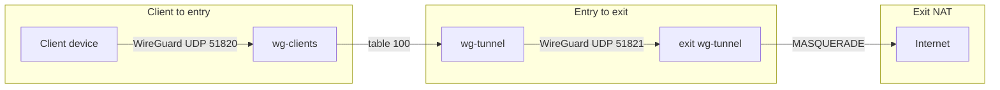

# Architecture

How the two-hop WireGuard stack and web panels fit together.

---

## Traffic path

End-user devices connect only to the **entry** server. Traffic is then forwarded through an encrypted tunnel to the **exit** server, which performs NAT to the internet.



```
┌──────────────┐   UDP 51820   ┌──────────────────────┐  tunnel 51821  ┌──────────────────┐
│  User device │ ────────────► │  Entry VPS           │ ─────────────► │  Exit VPS        │ ──► internet
│  WireGuard   │  Endpoint     │  wg-clients + panels │  wg-tunnel     │  NAT + egress    │
└──────────────┘               └──────────────────────┘                └──────────────────┘
```

| Plane | Path | Notes |
|-------|------|-------|
| VPN user traffic | client → entry → exit → internet | Two WireGuard encryptions; NAT on exit only |
| Management | SSH / HTTPS to entry (and SSH to exit) | Uses main routing table — not table 100 |
| Control plane | Panels on entry | Not in the WG forward path |
| Optional Xray | Client → entry :443/… | Separate from WG two-hop when enabled |

| Server | Role | WireGuard interfaces | Who connects |
|--------|------|----------------------|--------------|
| Entry | Client endpoint + web panels | `wg-clients` (users), `wg-tunnel` (to exit) | All VPN users; admin UI |
| Exit | Internet egress only | `wg-tunnel` (from entry) | Entry server only — **not** end users directly |

Default client subnet: `10.10.10.0/24` (override with `WG_CLIENT_CIDR`).

Install: [DEPLOYMENT.md](DEPLOYMENT.md). Day-2 ops: [OPERATIONS.md](OPERATIONS.md).

---

## VPN modes (per client)

| Mode | Path | Egress IP seen by websites | When to use |
|------|------|----------------------------|-------------|
| `twohop` (default) | Device → entry → tunnel → exit → internet | Exit server IP | **Production** — required architecture |
| `direct` | Device → entry → internet | Entry server IP | Diagnostic A/B only (not production) |

Set when creating a client in the admin panel **Clients** tab, or via CLI:

```bash
sudo wg-client set-mode CLIENT_NAME twohop
sudo wg-client sync-vpn-modes   # apply routing after bulk mode changes
```

---

## Web panels

Both panels run on the **entry** server and share one SQLite database.

| Panel | Path on server | systemd unit | Default port |
|-------|----------------|--------------|-------------|
| Client (users) | `/opt/wg/client-panel/` | `wg-panel.service` | 8088 |
| Admin | `/opt/wg/admin-panel/` | `wg-admin-panel.service` | 8090 |

### Shared data files

| File | Location | Purpose |
|------|----------|---------|
| User accounts, sessions, configs | `/etc/wireguard/panel.db` | SQLite — registration, approvals, assignments |
| WireGuard client configs | `/etc/wireguard/clients/*.conf` | `.conf` files delivered to users |
| Client metadata | `/etc/wireguard/state/*.meta` | Limits, expiry, VPN mode, usage |
| Admin credentials | `/etc/wireguard/admin.json` | PBKDF2-SHA256 password hash |
| Entry endpoint | `/etc/wireguard/wg-endpoint` | `IP:51820` written into every client config |
| Audit log | `/etc/wireguard/audit.db` | Per-action log with actor, IP, and timestamp |

Environment variables: `/etc/wireguard/entry-server.env` — see `/opt/wg-ops/config.env.example` or https://cdn.jsdelivr.net/gh/ahmadfarzad-amiri/wg@main/deploy/config.env.example

---

## Database schema highlights

`panel.db` key tables:

| Table | Notable columns |
|-------|----------------|
| `users` | `id`, `username`, `status`, `client_name`, `sub_token` |
| `sessions` | `token`, `user_id`, `expires_at` ← indexed |
| `requests` | `id`, `user_id`, `action`, `status` ← indexed |

`audit.db`:

| Table | Columns |
|-------|---------|
| `audit_log` | `id`, `actor`, `ip`, `action`, `detail`, `created_at` ← indexed |

The `sub_token` column on `users` is a random 32-character URL-safe token used to generate unauthenticated subscription URLs (`/sub/TOKEN`). Rotating the token invalidates the old URL.

---

## User lifecycle

```
Register (pending)
    │
    ▼
Admin approves + assigns a WireGuard client
    │
    ▼
approved ──► user downloads config ──► connects
    │
    ▼  (admin can)
disable / enable / assign more configs / reject
```

- One user can have **multiple** WireGuard clients assigned (multi-device, multi-tunnel).
- Primary client name is stored on the `users` row; full assignment list is in `panel.db`.
- Users download all assigned configs as a **ZIP** from Dashboard → Import link or Settings.

---

## Client panel — pages

| Page | What it does |
|------|--------------|
| **Dashboard** | Connect-first status, QR/download/copy, usage, Import link (when approved) |
| **Dashboard → Import link** | Subscription URL and download all configs as ZIP |
| **Support** | Submit renew/enable requests; view request history; check Server status |
| **Settings** | Change password, download configs, log out |

### Subscription link (`/sub/TOKEN`)

An unauthenticated endpoint that returns the user's WireGuard config(s) as plain text. Used by WireGuard apps that support subscription URLs for automatic config updates.

- Token is stored per-user in `panel.db` (`sub_token` column).
- Token can be rotated from Dashboard → Import link → **Rotate link**.
- Old token becomes invalid immediately after rotation.

### Server status (`/connection-test`)

A server-side check triggered from the Support page (labeled **Server status**). Returns JSON with three fields:

| Field | Checks |
|-------|--------|
| `wg_interface` | WireGuard interface is up and has peers |
| `exit_ping` | Exit server is reachable via ICMP through the tunnel |
| `dns` | Server can resolve external domain names |

---

## Admin panel — pages

| Page | What it does |
|------|--------------|
| **Dashboard** | Key metrics, recent requests, system health |
| **Clients** | Create (single or bulk), enable/disable, set limits, edit subscriptions |
| **Users** | Approve registrations, assign/unassign configs, disable/enable, reset passwords |
| **Requests** | Handle renew/enable/reject support tickets |
| **Active** | Live WireGuard connections (recent handshake ≤ 2 min) |
| **Tools** | Server infrastructure scripts, recent audit log (50 entries, with actor + IP) |
| **Settings** | Change admin password |

### Bulk client creation

Admin **Clients → Add clients in bulk**: accepts up to 50 newline-separated names, applies a shared VPN mode / days / limit to all, and returns a per-name summary (created / skipped / failed).

---

## Security model

| Area | Implementation |
|------|----------------|
| Passwords | PBKDF2-SHA256, 300 000 iterations, per-user salt |
| CSRF | Double-submit cookie pattern validated with `hmac.compare_digest` |
| Sessions | Random token in `sessions` table; purged on expiry (max once per 60 s under load) |
| X-Forwarded-For | Trusted only from `127.0.0.1` / `::1` / `localhost` |
| Admin bind | `127.0.0.1` by default; expose via nginx reverse proxy, not directly |
| Audit trail | Every admin action logged with actor username, source IP, and timestamp |

---

## Application performance

Key optimizations in the Python server (`http.server.ThreadingHTTPServer`):

| Area | Optimization |
|------|-------------|
| `wg show` calls | `wg_interface_up()` cached 5 s; per-map data cached 2 s with `threading.Lock` |
| User status page | `statuses_for_user()` makes **3** `wg show` calls total (not 3 per client) |
| Session purge | `DELETE FROM sessions` runs at most once per 60 s — not on every request |
| DB schema check | `ensure_user_configs_schema()` runs once per process, not on every DB read |
| SQLite | WAL mode + `busy_timeout=3000` on all databases including `audit.db` |
| DB indexes | `sessions.expires_at`, `requests.user_id`, `requests.status`, `users.status`, `audit.created_at` |

---

## Code layout (developers)

```
wg/
├── wg_common/          # Shared constants, password hashing, client status logic
├── client-panel/       # User-facing panel (Python, no external framework)
│   ├── app.py
│   ├── client_panel/
│   └── static/         # CSS, JS, QR, ZIP handlers
├── admin-panel/        # Admin panel
│   ├── app.py
│   ├── admin_panel/
│   └── static/
├── deploy/             # Install, backup, routing, validate, diagnose
├── tests/              # Unit tests (wg_common)
└── docs/               # Documentation (you are here)
```

Both panels use `http.server.ThreadingHTTPServer` — one OS thread per connection, no external web framework. All shared logic lives in `wg_common/`.
